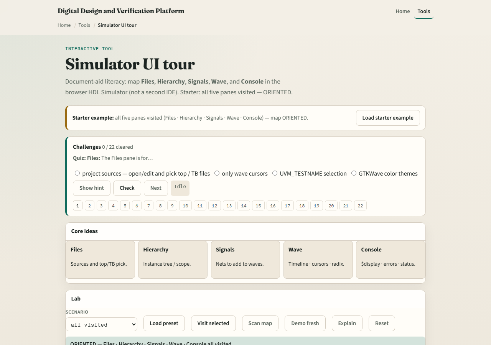

# UI tour

Before you debug a DUT, you need a mental map of the IDE

---

## The five panes
- Files hold project sources, open, edit, and pick the top or testbench files for the run
- Hierarchy is the elaborated instance tree
- Signals lists nets in that scope so you can add them to waves
- Wave is the timeline, cursors, zoom, and radix live there
- Console shows tool messages, display text, errors, and run or stop status

---

## Browser lab

---

## Public simulator practice
- In the public IDE, open a tiny project and deliberately click each pane once
- Say out loud what you would look for there
- That spoken map sticks better than skimming icons

---

## Pitfalls to watch
- Do not hunt for values in Files when you need Hierarchy and Signals
- Do not treat the concept lab as a full simulator
- And do not skip Console when a run fails

---

## Your turn
- Complete the checklist for at least one track, preferably both
- In the browser, reach oriented by visiting all five panes
- In the public IDE, name each pane’s job in one sentence
- When you are ready, take the short quiz, then continue to Hello DUT

