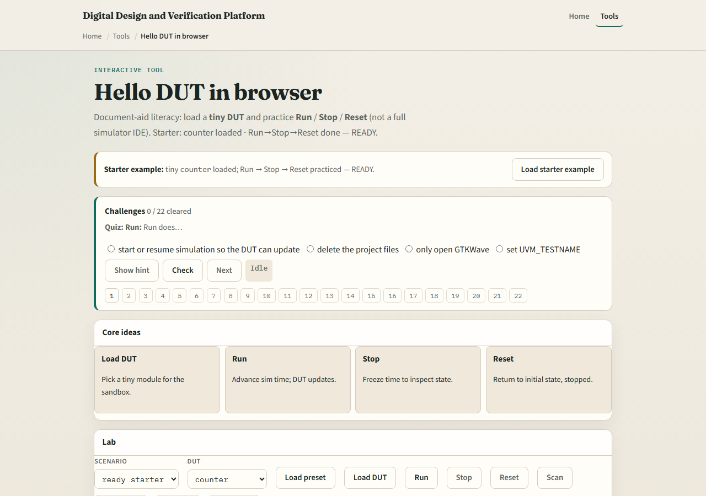

# Hello DUT

Orientation is not enough, you need a tiny design under control

---

## Run, Stop, Reset
- Run starts or resumes simulation time so the DUT updates each step
- Stop freezes time so you can inspect state without advancing the model
- Reset returns the DUT to its initial state and leaves the sim stopped
- Load picks which tiny sketch sits in the sandbox

---

## Browser lab

---

## Public simulator practice
- In the public IDE, open or paste a tiny counter with a short testbench
- Compile or elaborate, then hit Run, Stop, and Reset once each
- Confirm Console stays clean and that Reset actually clears the output you care about
- Keep the design tiny, this module is control literacy, not a full test plan

---

## Pitfalls to watch
- Do not confuse Reset of the DUT with closing the browser tab
- Do not leave Run forever when you meant to inspect a frozen state, Stop first
- And remember

---

## Your turn
- Complete the checklist for at least one track, preferably both
- In the browser, finish Run, Stop, and Reset on a loaded DUT
- In the public IDE, do the same triad on one tiny design
- When you are ready, take the short quiz, then continue to Step and Continue

