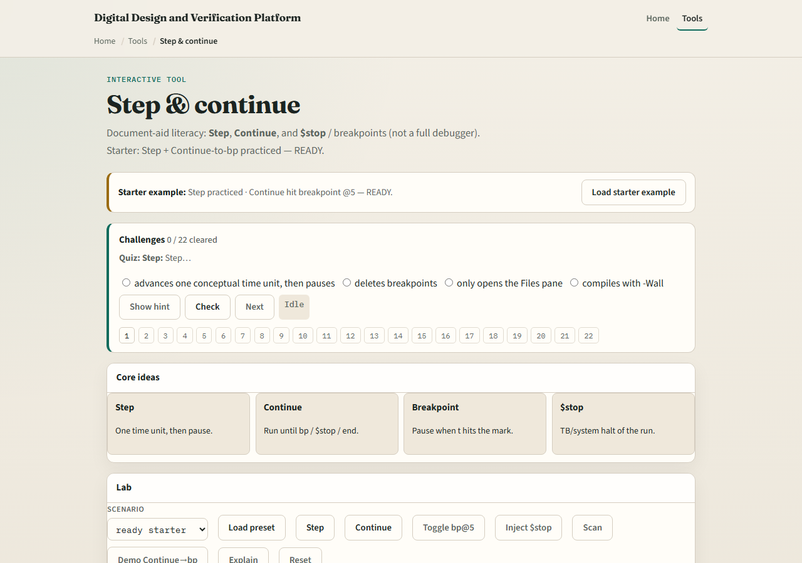

# Module 03 — Step & continue

**Module id:** module03-hdl-sim-step-continue
**Lab:** hdl-sim-step-continue
**Tracks:** A (public simulator) · B (browser lab)

## Slide 1 — Step & continue

Run is coarse. When something looks wrong, you need finer control: Step advances one conceptual time unit and pauses; Continue runs until a breakpoint, a system stop, or the end of a short window. Together with a halt, that triad is how you walk a bug without staring at a free-running clock.

## Slide 2 — Breakpoints and halt

A breakpoint pauses Continue when simulation time reaches a chosen tick. A system stop from the testbench is like a dynamic breakpoint—it halts the run so you can inspect. Practice all three moves: one Step, one Continue that hits a stop point, and recognizing that you are halted—not still running.

## Slide 3 — Browser lab

In the browser lab, load the starter where Step and Continue-to-breakpoint are already practiced, then try idle at time zero with a breakpoint armed. Step once, then Continue until the breakpoint hits. Challenges lock in the difference between a single Step and a Continue that runs to a halt.

## Slide 4 — Public simulator practice

In the public IDE, set or use whatever stop or breakpoint style the tool offers, then Step through a few edges of a tiny counter. Continue until you hit a deliberate stop in the testbench or a breakpoint you set. Say whether you are paused after Step, continuing, or halted—and why.

## Slide 5 — Pitfalls to watch

Do not mash Run when you meant Step—you will overshoot the interesting edge. Do not forget that Continue without a stop condition can race to the end of the window. And do not confuse a halted session with a crashed compile; check Console if nothing advances.

## Slide 6 — Your turn

Complete the checklist for at least one track—preferably both. Practice Step, Continue, and a halt once each. When you are ready, take the short quiz, then continue to poke, force, and release.
