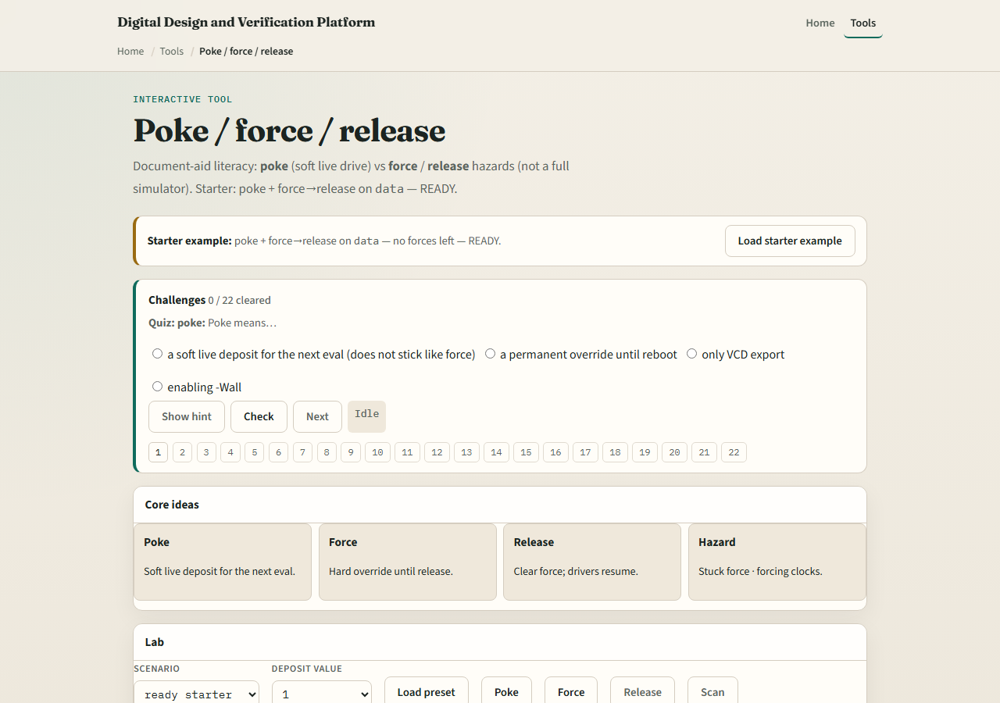

# Poke / force / release

Sometimes you need to deposit a value while the sim is live

---

## Soft poke vs sticky force
- Prefer poke when you want a temporary live value
- Prefer force only when you must hold a net against its drivers
- Reset nets can be held for debug; data nets are the usual poke or force targets
- Clocks are a special hazard: forcing a clock is unsafe and easy to forget

---

## Browser lab

---

## Public simulator practice
- In the public IDE, poke a data net once and observe the wave
- Force the same net, run a little, then release and confirm drivers resume
- Avoid forcing the clock
- If the tool warns about active forces, treat that as a first-class debug clue, not noise

---

## Pitfalls to watch
- Do not leave forces active and then “debug” wrong RTL
- Do not force clocks to “make time move.” Do not confuse poke with force
- And always know which signal you selected before you deposit a value

---

## Your turn
- Complete the checklist for at least one track, preferably both
- Practice poke, force, and release, and leave the session with no active forces
- When you are ready, take the short quiz, then continue to full-sim waves

