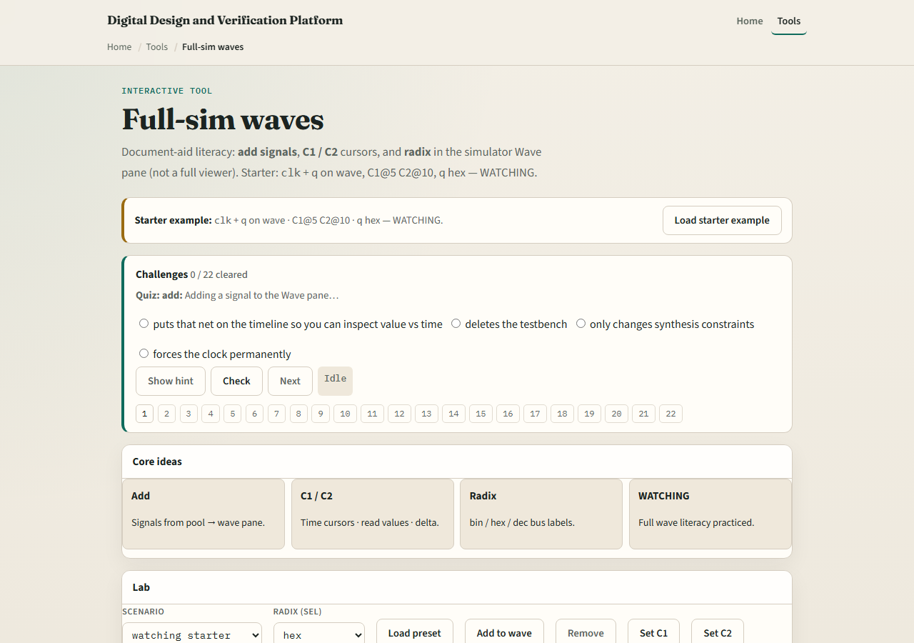

# Full-sim waves

Waves turn time into a picture

---

## Add, cursor, radix
- Pick a scope in Hierarchy, select signals, and add them to the wave pane
- Place cursor one at an interesting edge
- Switch radix when hex is clearer than a long binary string
- Zoom so the region you care about fills the view without losing context

---

## Browser lab

---

## Public simulator practice
- In the public IDE, add clock, reset, and a data output to the wave
- Run a short window, set two cursors around one interesting transition
- If a signal is missing, go back to Hierarchy and Signals, waves only show what you added

---

## Pitfalls to watch
- Do not debug from Console alone when the bug is timing, open the wave
- Do not forget which cursor is active when you read a value
- Do not overload the pane with every net in the design
- And remember concept labs animate literacy, the public IDE is where real TB time lives

---

## Your turn
- Complete the checklist for at least one track, preferably both
- Add signals, place two cursors, and read one value with a sensible radix
- When you are ready, take the short quiz, then continue to multi-file projects

