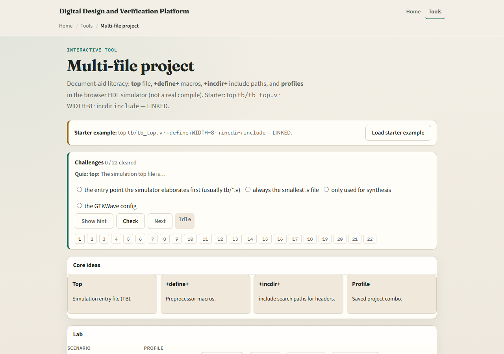

# Module 06 — Multi-file project

**Module id:** module06-hdl-sim-multi-file
**Lab:** hdl-sim-multi-file
**Tracks:** A (public simulator) · B (browser lab)

## Slide 1 — Multi-file project

Real designs are rarely one file. Multi-file literacy means knowing which sources are in the project, which file is the top or testbench, and how include or compile order affects elaboration. Get the file set wrong and you will debug the wrong module for an hour.

## Slide 2 — Top, TB, and linkage

Name the DUT file and the testbench file explicitly. Know which module is top for the run. If the IDE links multiple files into one session, confirm every needed source is present—missing a package or a sub-module shows up as hierarchy holes or compile errors in the Console.

## Slide 3 — Browser lab

In the browser multi-file lab, load the starter project and inspect how files are listed and which one is marked top. Try presets that drop a file or mis-mark top, and watch status leave ready. Challenges ask you to restore a coherent multi-file set before you “run.”

## Slide 4 — Public simulator practice

In the public IDE, open a tiny two-file sketch: DUT plus testbench. Confirm both appear under Files, set top correctly, and elaborate or run once. Intentionally remove the testbench from the set, note the Console error, then restore it—that muscle memory prevents silent wrong builds.

## Slide 5 — Pitfalls to watch

Do not assume the open editor tab is the top module. Do not forget packages or included files that the DUT needs. Do not mix two unrelated testbenches in one run and expect clean waves. Always reconcile Files with Hierarchy after a change.

## Slide 6 — Your turn

Complete the checklist for at least one track—preferably both. Build or restore a coherent DUT-plus-testbench file set and name the top. When you are ready, take the short quiz, then continue to golden compare.
