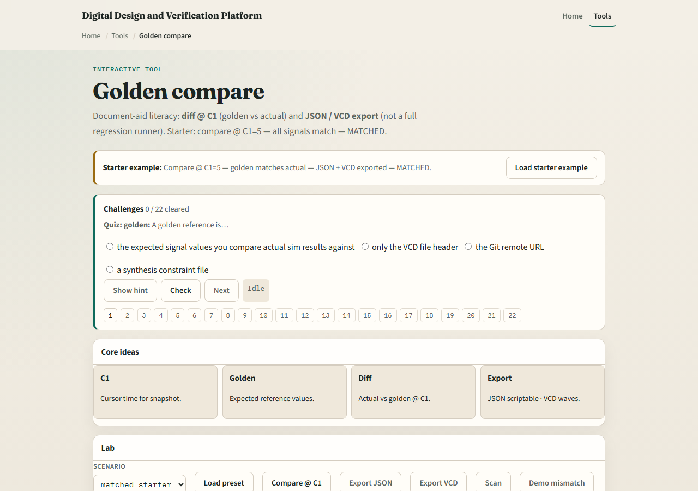

# Golden compare

A golden is an expected value or trace you trust

---

## Compare at a cursor
- Pick the signal, place cursor one at the check time, read the value with a clear radix
- A mismatch is not failure of the method, it is information
- Match means you earned a ready status for that check

---

## Browser lab

---

## Public simulator practice
- In the public IDE, run a tiny counter to a known time, place cursor one
- Then read the wave and compare
- Optional stretch

---

## Pitfalls to watch
- Do not compare at the wrong cursor or before the edge you meant
- Do not mix binary expectations with hex displays
- Do not treat a concept-lab pass as proof of silicon
- And do not skip naming which signal was compared, orphaned goldens confuse future you

---

## Your turn
- Complete the checklist for at least one track, preferably both
- Perform one golden compare at cursor one on a tiny DUT
- When you are ready, take the short quiz, then continue to the style and synth bridge

