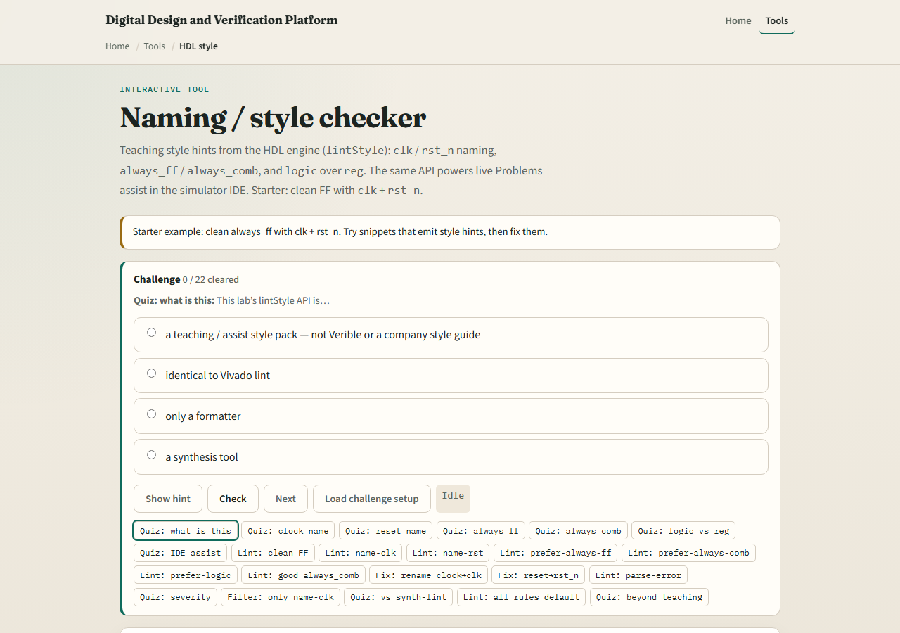

# Style & synth hints

Simulator literacy is not only Run and waves

---

## What to notice
- In style practice, watch naming, module structure
- In synth-lint practice
- One named idea you will watch for later is enough for this module

---

## Browser labs

---

## Public simulator practice
- In the public IDE
- Even if the IDE is quiet, ask yourself one synth question
- Carry that question into later Verilog and Verilator work

---

## Pitfalls to watch
- Do not treat this bridge as a complete coding-standard course
- Do not ignore lint just because the sim passed
- Do not “fix” synth issues by forcing signals in the wave, that hides the problem
- Keep the scope small: awareness now, depth in sibling courses

---

## Your turn
- Complete the checklist
- Optional: note the same idea once in the public simulator
- When you are ready, take the short quiz, then spend free practice time in the public IDE

